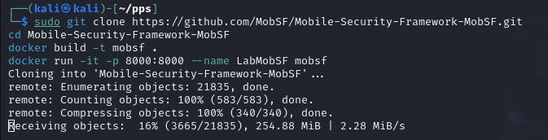
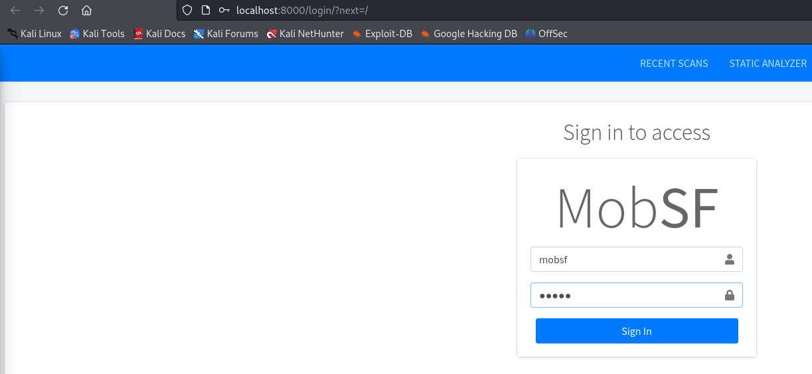
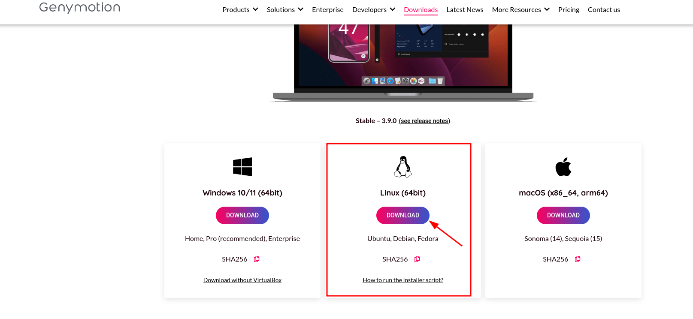
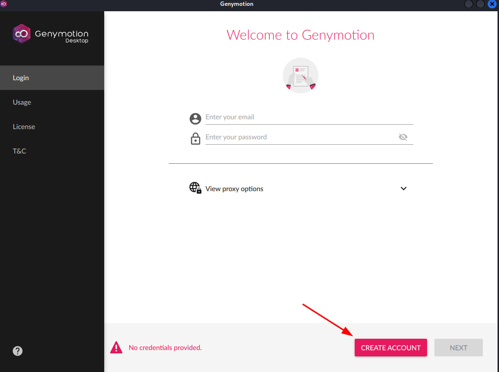
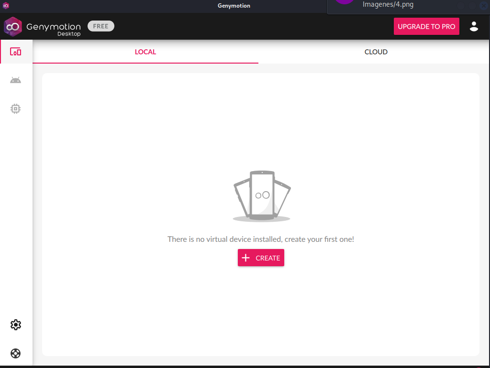
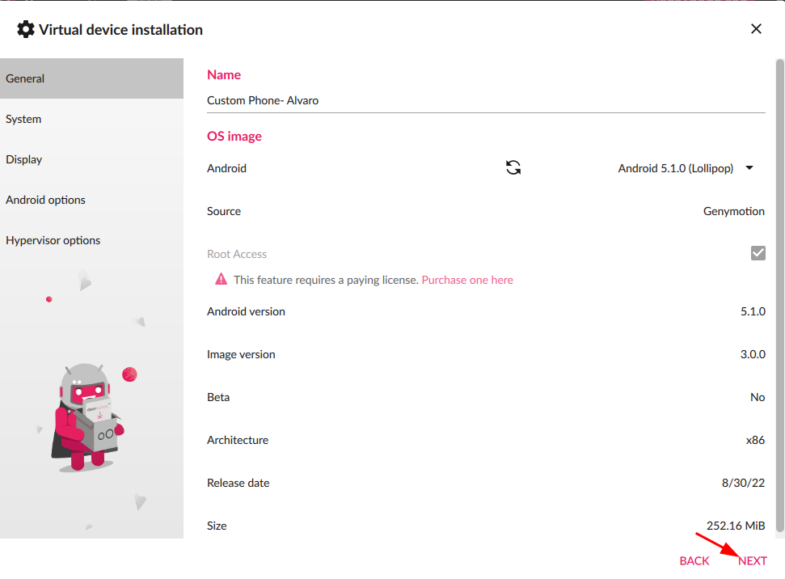
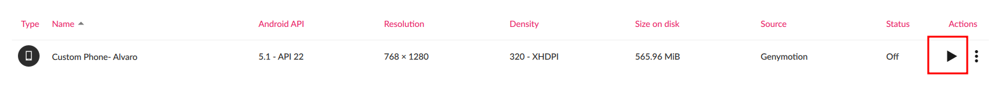
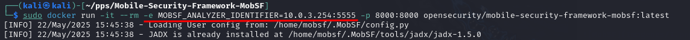
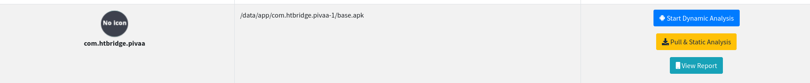
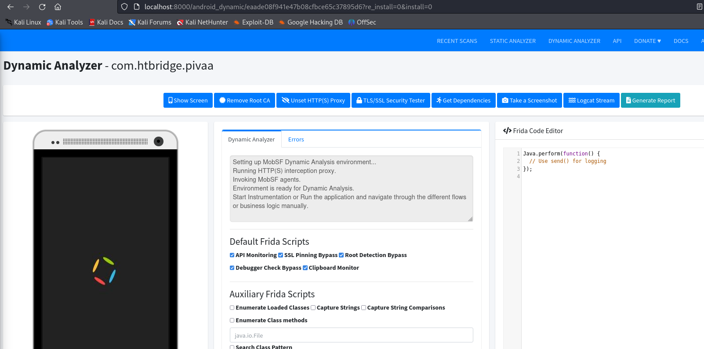

# Análisis Dinámico de APK con MobSF y Genymotion: InsecureBankv2

Lo primero es Obtener InsecureBankv2:

```
git clone https://github.com/dineshshetty/Android-InsecureBankv2.git
```

Y la apk en el siguiente enlace:

[apk](https://github.com/dineshshetty/Android-InsecureBankv2/blob/master/InsecureBankv2.apk)

Ahora debemos obtener MobSF:



Accedemos desde el navegador con las credenciales:



Ahora debemos obtener **Genymotion** desde su página oficial:



Lo instalamos y ya podemos acceder, ahora debemos crear una cuenta y acceder:





Una vez dentro creamos el dispositivo para virtualización:



Y le damos al play:



Una vez arrancado debemos consultar la ip e introducir en mobsf una variable de entorno con la ip:



Ya podemos arrastrar la apk, en mi caso voy a introducir **pivaa.apk** ya que al estar en un entrono virtualizado, no puedo realizarlo con **InsecureBankv2**:

Una vez que esta la apk, si recargamos la página de Mobsf Dynamic Analyzer ya nos aparece:



Podemos darle a **Start Dinamic Analysis** y comenzará el análisis.

Al terminar, ya nos muestra los resultados:



Y podemos consultar datos como:

- 
- Permisos en tiempo de ejecución.
- Tráfico de red y endpoints detectados.
- Interacciones con el sistema.
- Análisis de logs, broadcasts, servicios, etc.
- Captura de tráfico HTTPS (si está configurado con proxy o CA).

